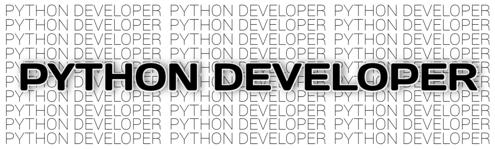

  

# Backend Developer

I hold a profound and genuine passion for backend development—it is more than a profession to me, it is a calling. I am captivated by the art of building robust server-side architectures, designing data flows, and creating the resilient, unseen foundations upon which applications truly operate.

To me, backend development represents the core engineering challenge: transforming abstract logic into efficient, scalable, and maintainable systems. There is immense satisfaction in architecting reliable APIs, optimizing performance, and ensuring the seamless orchestration of services that empower user experiences.

## Professional Journey & Ethos

I have cultivated my expertise over approximately one year of dedicated commercial development with Python. This period has been defined by intentional growth, a deep dive into architectural principles, and a commitment to writing clean, thoughtful code. I view technology as a craft that requires continuous refinement and learning.

## Perspective on the Current AI Landscape

While I acknowledge the innovative potential of artificial intelligence, I remain skeptical of the prevailing hype cycle that surrounds it. In my assessment, the current environment resembles a bubble, which I anticipate will contract significantly within the next 2–3 years. This consolidation will, I believe, separate substantive technological advancements from speculative trends, ultimately leaving only genuine industry leaders and truly indispensable automation tools. My focus remains on building tangible, logical systems that deliver concrete value today.

## Open Source Philosophy

I deeply respect the open-source paradigm and consider it a cornerstone of modern software development. I am committed to contributing to this collaborative ecosystem by sharing knowledge, refining projects, and participating in the community that drives our industry forward.

---

I welcome thoughtful dialogue on backend architecture, system design, and the pursuit of engineering excellence. Please feel free to explore my repositories or connect.

**Thank you for your time and consideration.**
